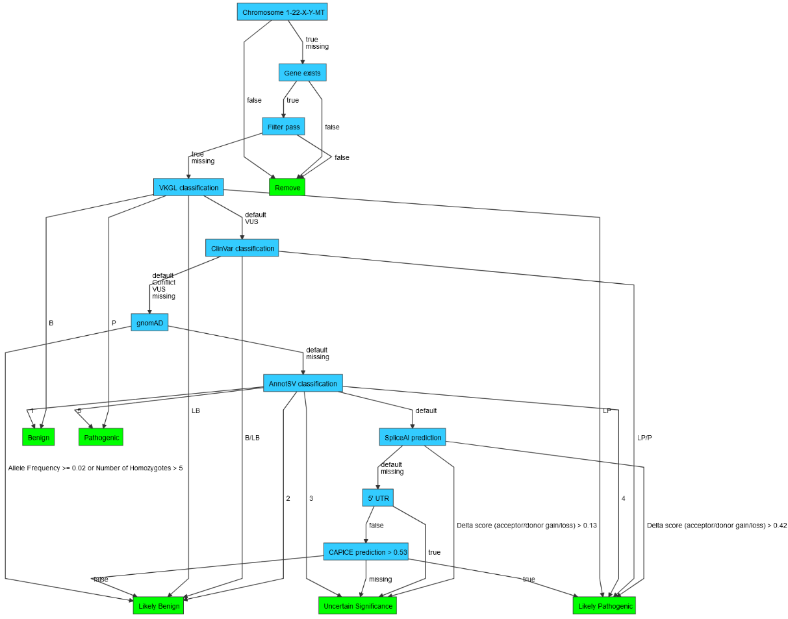

# Variant Interpretation Pipeline
VIP is a flexible human variant interpretation pipeline for rare disease using state-of-the-art pathogenicity prediction ([CAPICE](https://github.com/molgenis/capice)) and template-based interactive reporting to facilitate decision support.

## Content
- [Introduction](#introduction)
- [Prerequisites](#prerequisites)
- [Installation](#installation)
- [Usage](#usage)
  - [Workflow](#workflow)
  - [Input](#input)
    - [Input VCF](#input-vcf)
    - [Input CRAM](#input-cram)
    - [Input FASTQ](#input-fastq)
  - [Profile](#profile)
  - [Config](#config)
- [Configuration](#configuration)
  - [Classification Tree](#classification-tree)
  - [Report Template](#report-template)
- [Examples](#examples)
- [License](#license)
- [Acknowledgements](#acknowledgements)

## Introduction
The VIP pipeline can be used starting from either your [fastq](#input-fastq), [bam/cram](#input-cram) or [(g)VCF](#input-vcf) data, every entry point will result in a vcf.gz file with your annotated, classified and filtered variants as well as a [interactive html report](#report-template) with the same variants, prioritized by the CAPICE pathogenicity score and providing additional aids like a genome browser ([igv.js](https://github.com/igvteam/igv.js)) and a representation of the decisions leading to the [VIP classification](#classification-tree).

The VIP pipeline can easily be [installed](#installation) on a POSIX compatible system by simply checking out the reporistory and running the install script.

VIP can be used for single patients, families or cohort data.

## Prerequisites
- [POSIX compatible system](https://en.wikipedia.org/wiki/POSIX#POSIX-oriented_operating_systems) (e.g. Linux, macOS, [Windows Subsystem for Linux](https://learn.microsoft.com/en-us/windows/wsl/about))
- Bash ≥ 3.2
- Java ≥ 11
- [Apptainer](https://apptainer.org/docs/admin/main/installation.html#install-from-pre-built-packages) (setuid installation)
- ~400GB disk space

## Installation
```
git clone https://github.com/molgenis/vip
bash vip/install.sh
```
By default, the installation script downloads resources for both GRCh37 and GRCh38 assemblies.

Use `--assembly` to download recourses for a specific assembly:
```
bash vip/install.sh --assembly GRCh37
bash vip/install.sh --assembly GRCh38
```

## Usage
```
usage: vip -w <arg> -i <arg> -o <arg>
  -w, --workflow <arg>  workflow to execute. allowed values: cram, fastq, vcf
  -i, --input    <arg>  path to sample sheet .tsv
  -o, --output   <arg>  output folder
  -c, --config   <arg>  path to additional nextflow .cfg (optional)
  -p, --profile  <arg>  nextflow configuration profile (optional)
  -r, --resume          resume execution using cached results (default: false)
  -h, --help            print this message and exit
```  

### Workflow
The VIP workflow can be started from 3 different starting point: fastq, cram, of (g)vcf.

for a schematic represeantation of the workflow [click here](./docs/vip_workflow.png).

### Input
| column                | type            | required |                                        |
|-----------------------|-----------------|----------|----------------------------------------|
| ``project_id``        | ``string``      |          | default:vip                            |
| ``family_id``         | ``string``      |          | default:vip_fam&#60;index&#62;         |
| ``individual_id``     | ``string``      | yes      |                                        |
| ``paternal_id``       | ``string``      |          |                                        |
| ``maternal_id``       | ``string``      |          |                                        |
| ``sex``               | ``enum``        |          | values: [male,female]                  |
| ``affected``          | ``boolean``     |          |                                        |
| ``proband``           | ``boolean``     |          |                                        |
| ``hpo_ids``           | ``string list`` |          | regex: /HP:\d{7}/                      |
| ``assembly``          | ``enum``        |          | default:GRCh38 values: [GRCh37,GRCh38] |

#### Input VCF
| column  | type     | required |                                                               |
|---------|----------|----------|---------------------------------------------------------------|
| ``vcf`` | ``file`` | yes      | file extensions: [vcf, vcf.gz, vcf.bgz, bcf, bcf.gz, bcf.bgz] |
| ``cram``| ``file`` |          | file extensions: [bam, cram]                                  |

See [example](#vcf-multi-project)

#### Input CRAM
| column                  | type          | required |                                              |
|-------------------------|---------------|----------|----------------------------------------------|
| ``cram``                | ``file``      | yes      | file extensions: [bam, cram]                 |
| ``sequencing_platform`` | ``enum``      |          | default:illumina values: [illumina,nanopore] |
| ``sequencing_method``   | ``enum``      |          | default:WGS values: [WES,WGS]                |

#### Input FASTQ
| column                  | type          | required |                                               |
|-------------------------|---------------|----------|-----------------------------------------------|
| ``fastq``               | ``file list`` |          | file extensions: [fastq, fastq.gz, fq, fq.gz] |
| ``fastq_r1``            | ``file list`` |          | file extensions: [fastq, fastq.gz, fq, fq.gz] |
| ``fastq_r2``            | ``file list`` |          | file extensions: [fastq, fastq.gz, fq, fq.gz] |
| ``sequencing_platform`` | ``enum``      |          | default:illumina values: [illumina,nanopore]  |   
| ``sequencing_method``   | ``enum``      |          | default:WGS values: [WES,WGS]                 |

See [example](#fastq-giab-hg001-illumina-hiseq-exome)

### Profile
By default, VIP detects whether [Slurm](https://slurm.schedmd.com/) is available on the system and use the <code>slurm</code> profile. Otherwise, the <code>local</code> profile is used which executes the workflow on this machine. You can override the profile or refer to a custom profile specified in your <code>--config</code>.

Examples:
```
--profile local
--profile slurm
--profile my_profile_defined_in_my_nextflow_cfg
```

### Config
By default, VIP contains configuration that will allow all workflows to run on any machine assuming:
- Illumina sequencing platform
- GRCh38 reference genome ([GCA_000001405.15 / GCF_000001405.26](https://www.ncbi.nlm.nih.gov/assembly/GCF_000001405.26/))

An additional configuration file can be provided to override defaults:
```
--config my_nextflow.cfg
```

| param                         | default                                                                                   |                                |
|-------------------------------|-------------------------------------------------------------------------------------------|--------------------------------|
| ``GRCh37.reference.fasta``    | ``${projectDir}/resources/GRCh37/human_g1k_v37.fasta.gz``                                 ||
| ``GRCh37.reference.fastaFai`` | ``${projectDir}/resources/GRCh37/human_g1k_v37.fasta.gz.fai``                             ||
| ``GRCh37.reference.fastaGzi`` | ``${projectDir}/resources/GRCh37/human_g1k_v37.fasta.gz.gzi``                             ||
| ``GRCh38.reference.fasta``    | ``${projectDir}/resources/GRCh38/GCA_000001405.15_GRCh38_no_alt_analysis_set.fna.gz``     ||
| ``GRCh38.reference.fastaFai`` | ``${projectDir}/resources/GRCh38/GCA_000001405.15_GRCh38_no_alt_analysis_set.fna.gz.fai`` ||
| ``GRCh38.reference.fastaGzi`` | ``${projectDir}/resources/GRCh38/GCA_000001405.15_GRCh38_no_alt_analysis_set.fna.gz.gzi`` ||

For the full list, see [config/nxf.config](https://github.com/molgenis/vip/tree/main/config/nxf.config)

#### Config VCF
For the full list, see [config/nxf_vcf.config](https://github.com/molgenis/vip/tree/main/config/nxf_vcf.config)

#### Config CRAM
For the full list, see [config/nxf_cram.config](https://github.com/molgenis/vip/tree/main/config/nxf_cram.config)

#### Config FASTQ
| param                         | default                                                                                   |     |
|-------------------------------|-------------------------------------------------------------------------------------------|-----|
| ``GRCh37.reference.fastaMmi`` | ``${projectDir}/resources/GRCh37/human_g1k_v37.fasta.gz.mmi``                             ||
| ``GRCh38.reference.fastaMmi`` | ``${projectDir}/resources/GRCh38/GCA_000001405.15_GRCh38_no_alt_analysis_set.fna.gz.mmi`` ||

For the full list, see [config/nxf_fastq.config](https://github.com/molgenis/vip/tree/main/config/nxf_fastq.config)

## Configuration
Besides the technical configuration items described in the previous sections, VIP also offers functional configuration options.
The main functional configuration options are the variant and sample decision trees and the report template.

### Classification Tree
VIP can classify variants on two separate steps in the workflow, the first one immediately after annotation, and the second after inheritance matching.
The first classification is typically used to classify based on variant annotations, while the second provides the possibility to classify on combined variant and sample information.

The trees to classify the variants can be specified via a json file, all information present in the vcf file can be used in these tree's and the classes used as end states are also user defined. 
The parameters `vcf.classify.[assembly].decision_tree` and `vcf.classify_samples.[assembly].decision_tree` can be used to specify your own report template.
For more information on the decision tree format see [vip-decision-tree](https://github.com/molgenis/vip-decision-tree).

Based on this classification in combination with the classes stated in the configuration, VIP will filter the variants.


*Representation of the default tree for GRCh38*


*Representation of the default sample decision tree*

### Report Template
By default, VIP produces an interactive report stored in a standalone HTML file:

A report is created using a report template. The parameter `vcf.report.template` can be used to specify your own report template. For more details on reporting see the [VIP report](https://github.com/molgenis/vip-report) and [VIP report template](https://github.com/molgenis/vip-report-template) documentation.

## Examples
### FASTQ: GIAB HG001 (Illumina HiSeq Exome)
- Input: [Sample sheet](./docs/sample_sheet_giab_hg001.tsv)
- Command: `vip --workflow fastq --input sample_sheet_giab_hg001.tsv --output report`
- Output: [Report](./docs/vip_giab_hg001.html)

### VCF: Multi-project 
- Input: [Sample sheet](./test/resources/multiproject.tsv)
- Command: `vip --workflow vcf --input multiproject.tsv --output report`
- Output: [Report #0](./docs/vip0.html)
- Output: [Report #1](./docs/vip1.html)
- Output: [Report #2](./docs/vip2.html)

## License
VIP is released under the [LGPL-3.0 license](https://www.gnu.org/licenses/lgpl-3.0.en.html).

## Acknowledgements
Standing on the shoulders of giants. This project could not have possible without the existence of many other tools and resources. Among them we would like to thank the people behind the following projects:
- [Ensembl Variant Effect Predictor (VEP)](https://grch38.ensembl.org/info/docs/tools/vep/index.html)
- [Nextflow](https://www.nextflow.io/)
- [AnnotSV](https://lbgi.fr/AnnotSV/)
- [Illumina SpliceAI](https://github.com/Illumina/SpliceAI)
- [igv.js](https://github.com/igvteam/igv.js)
- [Clair3](https://github.com/HKU-BAL/Clair3)
- [Minimap2](https://github.com/lh3/minimap2)
- [GLnexus](https://github.com/dnanexus-rnd/GLnexus)
- [Samtools formats and tools](http://samtools.github.io/)
- [Human Phenotype Ontology Consortium](https://hpo.jax.org/)
- [Clinical Genomic Database](https://www.research.nhgri.nih.gov/CGD)
- [gnomAD](https://gnomad.broadinstitute.org/)
- [ClinVar](https://www.ncbi.nlm.nih.gov/clinvar)
- [VKGL](https://vkgl.molgeniscloud.org/)
- [phyloP](http://compgen.cshl.edu/phast)
