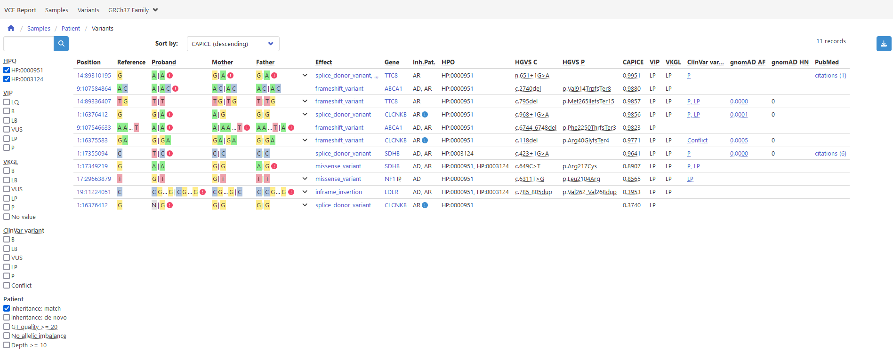

# Variant Interpretation Pipeline
VIP is a flexible human variant interpretation pipeline for rare disease using state-of-the-art pathogenicity prediction ([CAPICE](https://github.com/molgenis/capice)) and template-based interactive reporting to facilitate decision support.



## Documentation
VIP documentation is available at this link https://molgenis.github.io/vip/.

> [!TIP]
> Visit <a href="https://vip.molgeniscloud.org/">https://vip.molgeniscloud.org/</a> to analyse your own variants

## Quick Reference

### Requirements
- Java
- [Apptainer](https://apptainer.org/docs/admin/main/installation.html#install-from-pre-built-packages)
- 150GB free disk space

### Installation
```bash
git clone https://github.com/molgenis/vip
bash vip/install.sh
```

### Usage
```bash
usage: vip -w <arg> -i <arg> -o <arg>
  -w, --workflow <arg>  workflow to execute. allowed values: cram, fastq, gvcf, vcf
  -i, --input    <arg>  path to sample sheet .tsv
  -o, --output   <arg>  output folder
  -c, --config   <arg>  path to additional nextflow .cfg (optional)
  -p, --profile  <arg>  nextflow configuration profile (optional)
  -r, --resume          resume execution using cached results (default: false)
  -s, --stub            quickly prototype workflow logic using process script stubs
  -h, --help            print this message and exit
```

## Developers
To create the documentation pages:
```
pip install mkdocs mkdocs-mermaid2-plugin
mkdocs serve
```

### License
VIP is an aggregate work of many works, each covered by their own licence(s). For the purposes of determining what you can do with specific works in VIP, this policy should be read together with the licence(s) of the relevant tools. For the avoidance of doubt, where any other licence grants rights, this policy does not modify or reduce those rights under those licences.
