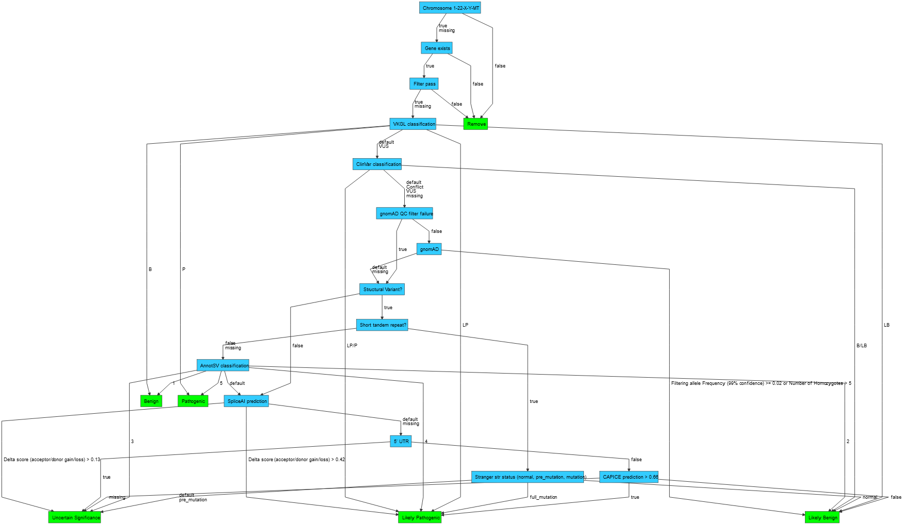
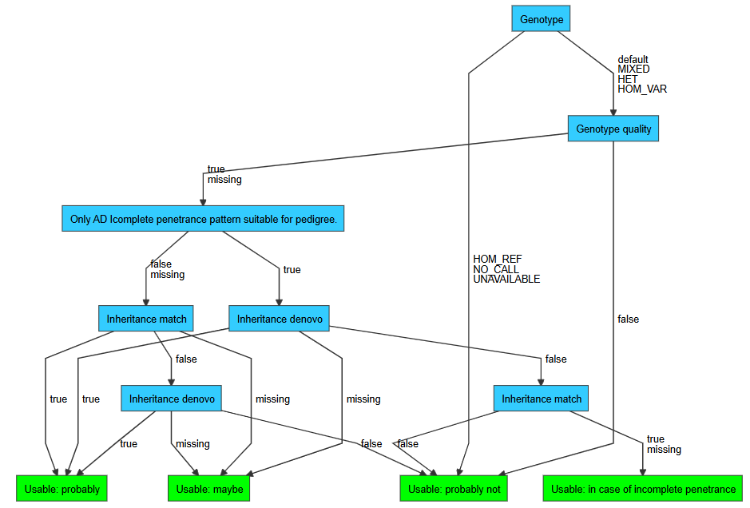

# Classification trees
In order to end up with a small list of candidate variant records for interpretation VIP performs variant filtration by:

1. Classify all variant-consequences based on variant annotations
2. Remove variant-consequences based on their classes
3. Annotate remaining variant records using inheritance matcher
4. Classify all variant-consequences based on variant annotations in the context of samples
5. Remove variant-consequences based on their classes.
6. Remove variants that had all their variant-consequences removed

The following sections describe the default variant filtration strategies and how to customize classification and filtration.

## Default
VIP contains default filtration strategies for variant-consequences (GRCh37 and GRCh38) as well as variant-consequences in the context of samples. 

### Variant-consequences
The default decision tree to classify variant-consequences works as follows:

1. Each variant-consequence is classified as `Benign`, `Likely Benign`, `VUS`, `Likely Pathogenic`, `Pathogenic` or `Remove`
2. Variant-consequences classified as `Benign`, `Likely Benign` and `Remove` are removed

*Above: default GRCh38 variant classification tree*

### Variant-consequences (samples)
The default decision tree to classify variant-consequences in the context of samples works as follows:

1. Each variant-consequence-sample is classified as `OK`, `LQ` (low quality) or `MV` (mendelian violation)
2. Variant-consequences classified as `LQ` for all samples are removed
 

*Above: default variant sample classification tree*

## Customization
The default variant filtration strategy can be customized using the following parameters (see [here](../usage/config.md#parameters)):

- `vcf.classify.GRCh37.decision_tree`
- `vcf.classify.GRCh38.decision_tree`
- `vcf.filter.classes`
- `vcf.classify_samples.GRCh37.decision_tree`
- `vcf.classify_samples.GRCh38.decision_tree`
- `vcf.filter_samples.classes`

The following repositories might be of interest when creating a new decision tree:

- [vip](https://github.com/molgenis/vip/tree/main/resources)
- [vip-decision-tree](https://github.com/molgenis/vip-decision-tree)

You are free to use your own set of classes in your decision tree. Keep in mind to update the filter classes parameters accordingly.  