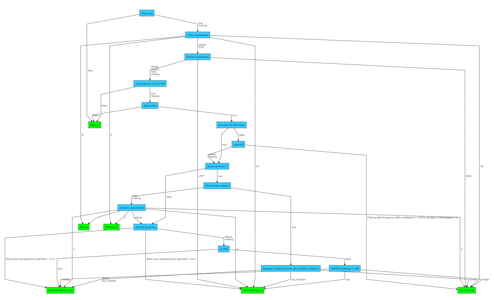

# Classification trees
In order to end up with a small list of candidate variant records for interpretation VIP performs variant filtration by:

1. Classify all variant-consequences based on variant annotations
2. Remove variant-consequences based on their classes
3. Annotate remaining variant records using inheritance matcher
4. Classify all variant-consequences based on variant annotations in the context of samples
5. Remove variant-consequences based on their classes.
6. Remove variants that had all their variant-consequences removed

The following sections describe the default variant filtration strategies and how to customize classification and filtration.

## Default
VIP contains default filtration strategies for variant-consequences as well as variant-consequences in the context of samples. 

### Variant-consequences
The default decision tree to classify variant-consequences works as follows:

1. Each variant-consequence is classified as `Benign`, `Likely Benign`, `VUS`, `Likely Pathogenic`, `Pathogenic` or `Remove`
2. Variant-consequences classified as `Benign`, `Likely Benign` and `Remove` are removed by default.

*Above: default GRCh38 variant classification tree*

### Variant-consequences (samples)
The default decision tree to classify variant-consequences in the context of samples works as follows:

1. Each variant-consequence-sample is classified as `U1` (usable: probably), `U2` (usable: maybe), `U3` (usable: probably not) and `U4` (usable: only in cases of suspected incomplete penetrance).
2. Variant-consequences classified as `U3` and `U4` for all samples are removed by default.
 

*Above: default variant sample classification tree*

## Customization and filtering

Please note that the classification tree only classifies variants, and filtering based on those classes is handled in the next step of the pipeline.
The behaviour of the filtering is based on the classes specified in the configuration of the pipeline.

### Configuration
Detailed documentation on how to modify or create your own decision tree can be found [here](https://github.com/molgenis/vip-decision-tree).

To use your modified or own decision tree the following parameter(s) should be updated (see [here](../usage/config.md#parameters)).
For the difference between the two configuration items see the sections above and the decision tree module [documentation](https://github.com/molgenis/vip-decision-tree).
- `vcf.classify.GRCh38.decision_tree`
- `vcf.classify_samples.GRCh38.decision_tree`

To customize the filtering of the variants based on the classification the following parameters can be updated (see [here](../usage/config.md#parameters)).
These parameters should contain a comma separated list of classes (values of the LEAF nodes) of your decision tree you would like to keep.
- `vcf.filter.classes`
- `vcf.filter_samples.classes`

The following repositories might be of interest when creating a new decision tree:

- [vip](https://github.com/molgenis/vip/tree/main/resources)
- [vip-decision-tree](https://github.com/molgenis/vip-decision-tree)