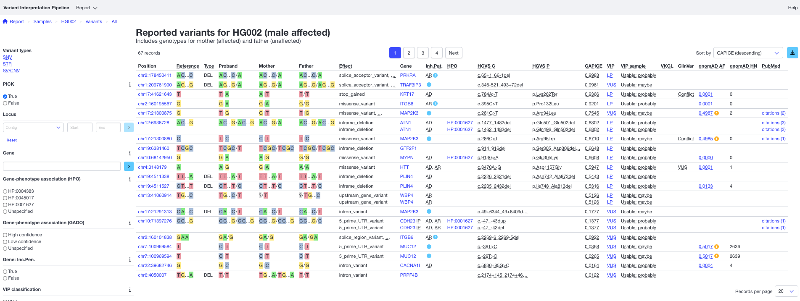

# Report templates
VIP outputs a standalone HTML report that can be viewed in any modern browser.
The report is based on the input sample sheet information and the output variant `vcf` data.

## Default
As a default VIP uses a report template that is suitable for most analysis:

*Above: default report template*

## Customization
Using the `vcf.report.template` parameter (see [here](../usage/config.md#parameters)) it is possible to specify a different report template to create reports tailered to your needs. 

The following repositories might be of interest when creating a new report template:

- [vip-report-api](https://github.com/molgenis/vip-report-api)
- [vip-report-template](https://github.com/molgenis/vip-report-template)
- [vip-report-vcf](https://github.com/molgenis/vip-report-vcf)
- [vite-plugin-inline](https://github.com/molgenis/vite-plugin-inline)

The `vip-report` tool creates reports based on a report template as described in the following repositories:

- [vip-report](https://github.com/molgenis/vip-report)
- [vip-utils](https://github.com/molgenis/vip-utils)