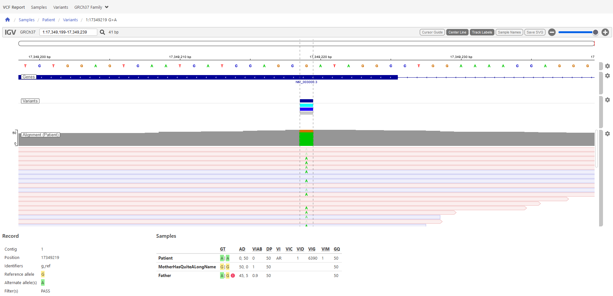

# Variant Interpretation Pipeline (VIP)
VIP is a flexible human variant interpretation pipeline for rare disease using state-of-the-art pathogenicity prediction ([CAPICE](https://github.com/molgenis/capice)) and template-based interactive reporting to facilitate decision support.

The VIP pipeline can be used starting from either your `fastq`, `bam/cram` or `.g.vcf/vcf` data,
every entry point will result in a `vcf` file with your annotated, classified and filtered variants 
as well as a interactive HTML report with the same variants, prioritized by the CAPICE pathogenicity score 
and providing additional aids like a genome browser and a representation of the decisions leading to the VIP classification.
VIP can be used for single patients, families or cohort data.

[Click here for a live example](vip_giab_hg001.html)

]

*Above: report example*

*Above: report example: genome browser*