# Workflow
VIP consists of three workflows depending on the type of input data: fastq, bam/cram or (g)vcf.
The `fastq` workflow is an extension of the `cram` workflow. The `cram` workflow is an extension of the `vcf` workflow.
The `vcf` workflow produces the pipeline outputs as described [here](./output.md).
The following sections provide an overview of the steps of each of these workflows. 

```mermaid
flowchart TD
    p0((Channel.from))
    p1([map])
    p2([map])
    p3([branch])
    p4[minimap2_index]
    p5([map])
    p6([mix])
    p7([branch])
    p8([branch])
    p9([map])
    p10[fastq:concat_fastq_paired_end]
    p11([map])
    p12([mix])
    p13([map])
    p14[fastq:minimap2_align_paired_end]
    p15([map])
    p16([branch])
    p17([map])
    p18[fastq:concat_fastq]
    p19([map])
    p20([mix])
    p21([map])
    p22[fastq:minimap2_align]
    p23([map])
    p24([mix])
    p25([branch])
    p26([map])
    p27[fastq:cram:samtools_index]
    p28([map])
    p29([mix])
    p30([flatMap])
    p31([multiMap])
    p32([map])
    p33[fastq:cram:clair3_call]
    p34([multiMap])
    p35([branch])
    p36([map])
    p37[fastq:cram:manta_call]
    p38([multiMap])
    p39([map])
    p40[fastq:cram:sniffles2_call]
    p41([multiMap])
    p42([map])
    p43([groupTuple])
    p44([map])
    p45[fastq:cram:manta_call_publish]
    p46(( ))
    p47([map])
    p48([groupTuple])
    p49([map])
    p50[fastq:cram:sniffles_call_publish]
    p51(( ))
    p52([mix])
    p53([map])
    p54([map])
    p55([map])
    p56([groupTuple])
    p57([map])
    p58[fastq:cram:clair3_call_publish]
    p59(( ))
    p60([map])
    p61([map])
    p62([mix])
    p63([groupTuple])
    p64([map])
    p65[fastq:cram:concat_vcf]
    p66([map])
    p67([map])
    p68([groupTuple])
    p69([map])
    p70([branch])
    p71([map])
    p72[fastq:cram:vcf:convert]
    p73([map])
    p74([map])
    p75[fastq:cram:vcf:index]
    p76([map])
    p77([map])
    p78[fastq:cram:vcf:stats]
    p79([map])
    p80([mix])
    p81([flatMap])
    p82([map])
    p83([groupTuple])
    p84([map])
    p85([branch])
    p86([map])
    p87[fastq:cram:vcf:merge_vcf]
    p88([map])
    p89([map])
    p90[fastq:cram:vcf:merge_gvcf]
    p91([map])
    p92([map])
    p93([mix])
    p94([branch])
    p95([flatMap])
    p96([branch])
    p97([map])
    p98[fastq:cram:vcf:split]
    p99([map])
    p100([mix])
    p101([map])
    p102([branch])
    p103([branch])
    p104[fastq:cram:vcf:normalize]
    p105([mix])
    p106([branch])
    p107[fastq:cram:vcf:annotate]
    p108([multiMap])
    p109([mix])
    p110([map])
    p111([groupTuple])
    p112([map])
    p113[fastq:cram:vcf:annotate_publish]
    p114(( ))
    p115([mix])
    p116([branch])
    p117[fastq:cram:vcf:classify]
    p118([multiMap])
    p119([mix])
    p120([map])
    p121([groupTuple])
    p122([map])
    p123[fastq:cram:vcf:classify_publish]
    p124(( ))
    p125([mix])
    p126([branch])
    p127[fastq:cram:vcf:filter]
    p128([branch])
    p129([mix])
    p130([branch])
    p131[fastq:cram:vcf:inheritance]
    p132([mix])
    p133([branch])
    p134[fastq:cram:vcf:classify_samples]
    p135([multiMap])
    p136([mix])
    p137([map])
    p138([groupTuple])
    p139([map])
    p140[fastq:cram:vcf:classify_samples_publish]
    p141(( ))
    p142([mix])
    p143([branch])
    p144[fastq:cram:vcf:filter_samples]
    p145([branch])
    p146([mix])
    p147([map])
    p148([groupTuple])
    p149([map])
    p150([branch])
    p151[fastq:cram:vcf:concat]
    p152([map])
    p153([branch])
    p154([map])
    p155([mix])
    p156([branch])
    p157([flatMap])
    p158([map])
    p159[fastq:cram:vcf:slice]
    p160([map])
    p161([map])
    p162([groupTuple])
    p163([map])
    p164([mix])
    p165([map])
    p166[fastq:cram:vcf:report]
    p167(( ))
    p0 --> p1
    p1 --> p2
    p2 --> p3
    p3 --> p4
    p3 --> p6
    p4 --> p5
    p5 -->|ch_index_indexed| p6
    p6 -->|meta| p7
    p7 --> p8
    p7 --> p16
    p8 --> p9
    p8 --> p12
    p9 --> p10
    p10 --> p11
    p11 -->|ch_input_paired_end_merged| p12
    p12 --> p13
    p13 --> p14
    p14 --> p15
    p15 -->|ch_input_paired_end_aligned| p24
    p16 --> p20
    p16 --> p17
    p17 --> p18
    p18 --> p19
    p19 -->|ch_input_single_merged| p20
    p20 --> p21
    p21 --> p22
    p22 --> p23
    p23 -->|ch_input_single_aligned| p24
    p24 -->|meta| p25
    p25 --> p29
    p25 --> p26
    p26 --> p27
    p27 --> p28
    p28 -->|ch_cram_indexed| p29
    p29 --> p30
    p30 --> p31
    p31 --> p32
    p31 --> p35
    p32 --> p33
    p33 --> p34
    p34 --> p55
    p34 --> p60
    p35 --> p36
    p35 --> p39
    p36 --> p37
    p37 --> p38
    p38 --> p52
    p38 --> p42
    p39 --> p40
    p40 --> p41
    p41 --> p47
    p41 --> p52
    p42 --> p43
    p43 --> p44
    p44 --> p45
    p45 --> p46
    p47 --> p48
    p48 --> p49
    p49 --> p50
    p50 --> p51
    p52 --> p53
    p53 --> p54
    p54 -->|ch_vcf_chunked_svs| p62
    p55 --> p56
    p56 --> p57
    p57 --> p58
    p58 --> p59
    p60 --> p61
    p61 -->|ch_vcf_chunked_snvs_done| p62
    p62 --> p63
    p63 --> p64
    p64 --> p65
    p65 --> p66
    p66 -->|meta| p67
    p67 --> p68
    p68 --> p69
    p69 --> p70
    p70 --> p71
    p70 --> p80
    p70 --> p74
    p70 --> p77
    p71 --> p72
    p72 --> p73
    p73 -->|ch_vcfs_converted| p80
    p74 --> p75
    p75 --> p76
    p76 -->|ch_vcfs_indexed| p80
    p77 --> p78
    p78 --> p79
    p79 -->|ch_vcfs_statsed| p80
    p80 --> p81
    p81 -->|ch_vcfs_preprocessed| p82
    p82 --> p83
    p83 --> p84
    p84 --> p85
    p85 --> p89
    p85 --> p92
    p85 --> p86
    p86 --> p87
    p87 --> p88
    p88 -->|ch_project_vcfs_merged_vcfs| p93
    p89 --> p90
    p90 --> p91
    p91 -->|ch_project_vcfs_merged_gvcfs| p93
    p92 --> p93
    p93 -->|ch_project_vcfs_merged| p94
    p94 --> p95
    p94 --> p100
    p95 --> p96
    p96 --> p100
    p96 --> p97
    p97 --> p98
    p98 --> p99
    p99 -->|ch_inputs_splitted| p100
    p100 -->|ch_inputs_scattered| p101
    p101 --> p102
    p102 --> p109
    p102 --> p103
    p103 --> p104
    p103 --> p105
    p104 --> p105
    p105 --> p106
    p106 --> p115
    p106 --> p107
    p107 --> p108
    p108 --> p115
    p108 --> p109
    p109 --> p110
    p110 --> p111
    p111 --> p112
    p112 --> p113
    p113 --> p114
    p115 --> p116
    p116 --> p125
    p116 --> p117
    p117 --> p118
    p118 --> p119
    p118 --> p125
    p102 --> p119
    p119 --> p120
    p120 --> p121
    p121 --> p122
    p122 --> p123
    p123 --> p124
    p125 --> p126
    p126 --> p129
    p126 --> p127
    p127 --> p128
    p128 --> p136
    p128 --> p129
    p129 --> p130
    p130 --> p132
    p130 --> p131
    p131 --> p132
    p132 --> p133
    p133 --> p142
    p133 --> p134
    p134 --> p135
    p135 --> p142
    p135 --> p136
    p102 --> p136
    p136 --> p137
    p137 --> p138
    p138 --> p139
    p139 --> p140
    p140 --> p141
    p142 --> p143
    p143 --> p146
    p143 --> p144
    p144 --> p145
    p145 --> p146
    p145 --> p146
    p128 --> p146
    p102 --> p146
    p146 --> p147
    p147 --> p148
    p148 --> p149
    p149 --> p150
    p150 --> p154
    p150 --> p151
    p151 --> p152
    p152 --> p153
    p153 --> p155
    p153 --> p155
    p154 -->|ch_output_singleton| p155
    p155 --> p156
    p156 --> p164
    p156 --> p157
    p157 --> p158
    p158 --> p159
    p159 --> p160
    p160 --> p161
    p161 --> p162
    p162 --> p163
    p163 -->|ch_sliced| p164
    p164 --> p165
    p165 --> p166
    p166 --> p167
```

*Above: Nextflow rendering of the `fastq` workflow*

## FASTQ
The `fastq` workflow consists of the following steps:

1. Parallelize sample sheet per sample and for each sample
2. Discover fastq index files and create missing indices
3. In case of multiple fastq files per sample, concatenate the files
4. Alignment using [minimap2](https://github.com/lh3/minimap2) producing a `cram` file per sample
5. Continue with step 2. of the `cram` workflow

For details, see [here](https://github.com/molgenis/vip/blob/main/vip_fastq.nf).

## CRAM
The `cram` workflow consists of the following steps:

1. Parallelize sample sheet per sample and for each sample
2. Discover cram index files and create missing indices
3. Parallelize cram in chunks consisting of one or more contigs and for each chunk
    1. Perform short variant calling with [Clair3](https://github.com/HKU-BAL/Clair3) producing a `vcf` file per chunk per sample
    2. Perform structural variant calling with [Manta](https://github.com/Illumina/manta) or [Sniffles2](https://github.com/fritzsedlazeck/Sniffles) producing a `vcf` file per chunk per sample
4. Concatenate short variant calling and structural variant calling `vcf` files per chunk per sample
5. Continue with step 3. of the `vcf` workflow

Known limitation: Clair3 is not calling the small variants on the Mitochondia.

For details, see [here](https://github.com/molgenis/vip/blob/main/vip_cram.nf).

## VCF
The `vcf` workflow consists of the following steps:

1. Parallelize sample sheet per sample and for each sample
2. Discover cram index files and create missing indices
3. Merge `vcf` files (using [GLnexus](https://github.com/dnanexus-rnd/GLnexus) in case of .g.vcf files) resulting in one `vcf` (per chunk) per project
4. If the data is not chunked: parallelize `vcf` files in chunks consisting of one or more contigs and for each chunk and for each chunk
    1. Normalize
    2. Annotate
    3. Classify
    4. Filter
    5. Perform inheritance matching
    6. Classify in the context of samples
    7. Filter in the context of samples
5. Concatenate chunks resulting in one vcf file per project
6. If `cram` data is available slice the `cram` files to only keep relevant reads
7. Create report

For details, see [here](https://github.com/molgenis/vip/blob/main/vip_vcf.nf).