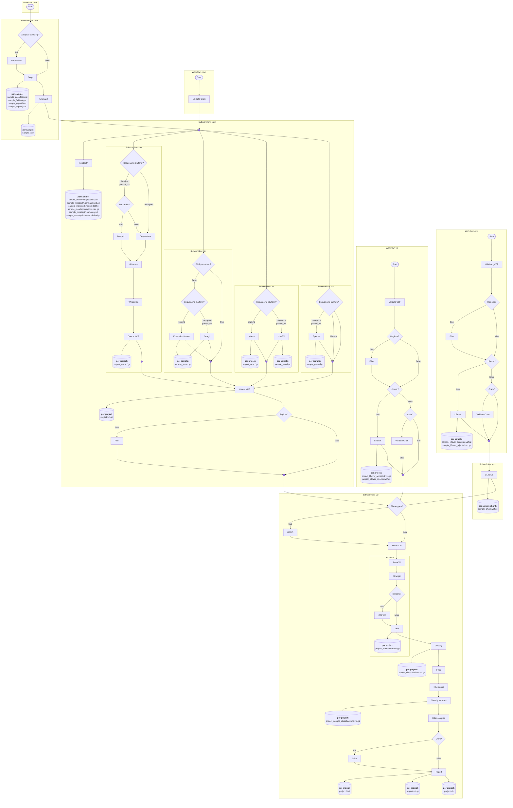

# Workflow

```mermaid
flowchart TB
subgraph "Subworkflow: vcf"
subgraph "annotate"
va0[AnnotSV]
va1[Stranger]
va2{SpliceAI?}
va3[CAPICE]
va4[VEP]
va4t[(<b>per project:</b><br>project_annotations.vcf.gz)]
va0-->va1
va1-->va2
va2-->|"true"|va3
va2-->|"false"|va4
va3-->va4
va4-->va4t
end
v0{Phenotypes?}
v1[GADO]
v2[Normalize]
v3[Classify]
v3t[(<b>per project:</b><br>project_classifications.vcf.gz)]
v4[Filter]
v5[Inheritance]
v6[Classify samples]
v6t[(<b>per project:</b><br>project_sample_classifications.vcf.gz)]
v7[Filter samples]
v8{Cram?}
v9[Slice]
v10[Report]
v10t0[(<b>per project:</b><br>project.html)]
v10t1[(<b>per project:</b><br>project.vcf.gz)]
v10t2[(<b>per project:</b><br>project.db)]
v0-->|"true"|v1
v0-->|"false"|v2
v1-->v2
v2-->va0
v3-->v3t
v3-->v4
v4-->v5
v5-->v6
v6-->v6t
v6-->v7
v7-->v8
v8-->|"true"|v9
v8-->|"false"|v10
v9-->v10
v10-->v10t0
v10-->v10t1
v10-->v10t2
va4-->v3
end
subgraph "Workflow: vcf"
wv([Start])
wv0[Validate VCF]
wv1{Regions?}
wv2[Filter]
wv3{Liftover?}
wv4[Liftover]
wv4t[(<b>per project:</b><br>project_liftover_accepted.vcf.gz<br>project_liftover_rejected.vcf.gz)]
wv5{Cram?}
wv6[Validate Cram]
wv7@{ shape: f-circ, label: "Junction" }
wv-->wv0
wv0-->wv1
wv1-->|"true"|wv2
wv1-->|"false"|wv3
wv2-->wv3
wv3-->|"true"|wv4
wv3-->|"false"|wv5
wv4-->wv4t
wv4-->wv7
wv5-->wv6
wv5-->|"true"|wv7
wv6-->|"false"|wv7
wv7-->v0
end
subgraph "Subworkflow: gvcf"
g0[GLnexus]
g0t[(<b>per sample chunk:</b><br>sample_chunk.vcf.gz)]
g0-->g0t
g0-->v0
end
subgraph "Workflow: gvcf"
wg([Start])
wg0[Validate gVCF]
wg1{Regions?}
wg2[Filter]
wg3{Liftover?}
wg4[Liftover]
wg4t[(<b>per sample:</b><br>sample_liftover_accepted.vcf.gz<br>sample_liftover_rejected.vcf.gz)]
wg5{Cram?}
wg6[Validate Cram]
wg7@{ shape: f-circ, label: "Junction" }
wg-->wg0
wg0-->wg1
wg1-->|"true"|wg2
wg1-->|"false"|wg3
wg2-->wg3
wg3-->|"true"|wg4
wg3-->|"false"|wg5
wg4-->wg4t
wg4-->wg7
wg5-->wg6
wg5-->wg7
wg6-->wg7
wg7-->g0
end
subgraph "Subworkflow: cram"
subgraph "Subworkflow: cnv"
cc0{Sequencing platform?}
cc1[Spectre]
cc1t[(<b>per sample:</b><br>sample_cnv.vcf.gz)]
cc2@{ shape: f-circ, label: "Junction" }
cc0-->|"nanopore<br>pacbio_hifi"|cc1
cc0-->|"illumina"|cc2
cc1-->cc1t
cc1-->cc2
cc0-->cc2
end
subgraph "Subworkflow: snv"
cn0{Sequencing platform?}
cn1{Trio or duo?}
cn2[Deeptrio]
cn3[Deepvariant]
cn4[GLnexus]
cn5[WhatsHap]
cn6[Concat VCF]
cn6t[(<b>per project:</b><br>project_snv.vcf.gz)]
cn7@{ shape: f-circ, label: "Junction" }
cn0-->|"illumina<br>pacbio_hifi"|cn1
cn0-->|"nanopore"|cn3
cn1-->|"true"|cn2
cn1-->|"false"|cn3
cn2-->cn4
cn3-->cn4
cn4-->cn5
cn5-->cn6
cn6-->cn6t
cn6-->cn7
end
subgraph "Subworkflow: str"
ct0{PCR performed?}
ct1{Sequencing platform?}
ct2[Expansion Hunter]
ct3[Straglr]
ct2-3t[(<b>per sample:</b><br>sample_str.vcf.gz)]
ct4@{ shape: f-circ, label: "Junction" }
ct0-->|"false"|ct1
ct0-->|"true"|ct4
ct1-->|"illumina"|ct2
ct1-->|"nanopore<br>pacbio_hifi"|ct3
ct2-->ct2-3t
ct2-->ct4
ct3-->ct2-3t
ct3-->ct4
end
subgraph "Subworkflow: sv"
cv0{Sequencing platform?}
cv1[Manta]
cv1t[(<b>per project:</b><br>project_sv.vcf.gz)]
cv2[cuteSV]
cv2t[(<b>per sample:</b><br>sample_sv.vcf.gz)]
cv3@{ shape: f-circ, label: "Junction" }
cv0-->|"illumina"|cv1
cv0-->|"nanopore<br>pacbio_hifi"|cv2
cv1-->cv1t
cv1-->cv3
cv2-->cv3
cv2-->cv2t
end
c0@{ shape: f-circ, label: "Junction" }
c1[mosdepth]
c1t[(<b>per sample:</b><br>sample_mosdepth.global.dist.txt<br>sample_mosdepth.per-base.bed.gz<br>sample_mosdepth.region.dist.txt<br>sample_mosdepth.regions.bed.gz<br>sample_mosdepth.summary.txt<br>sample_mosdepth.thresholds.bed.gz)]
c6[concat VCF]
c6t[(<b>per project</b><br>project.vcf.gz)]
c7{Regions?}
c8[Filter]
c9@{ shape: f-circ, label: "Junction" }
c0-->c1
c0-->cn0
c0-->ct0
c0-->cv0
c0-->cc0
c1-->c1t
cn7-->c6
ct4-->c6
cv3-->c6
cc2-->c6
c6-->c6t
c6-->c7
c7-->|"true"|c8
c7-->|"false"|c9
c8-->c9
c9-->v0
end
subgraph "Workflow: cram"
wc([Start])
wc0[Validate Cram]
wc-->wc0
wc0-->c0
end
subgraph "Subworkflow: fastq"
f0{Adaptive sampling?}
f1[Filter reads]
f2[fastp]
f2t[(<b>per sample:</b><br>sample_pass.fastq.gz<br>sample_fail.fastq.gz<br>sample_report.html<br>sample_report.json)]
f3[minimap2]
f3t0[(<b>per sample:</b><br>sample.cram)]
f0-->|"true"|f1
f0-->|"false"|f2
f1-->f2
f2-->f2t
f2-->f3
f3-->f3t0
f3-->c0
end
subgraph "Workflow: fastq"
wf([Start])
wf-->f0
end
```